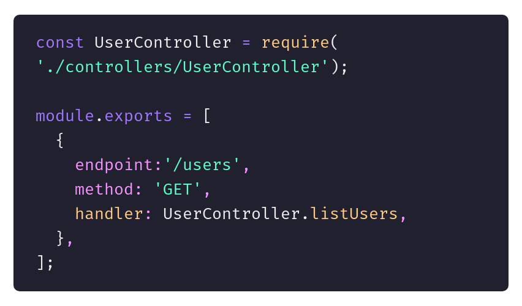
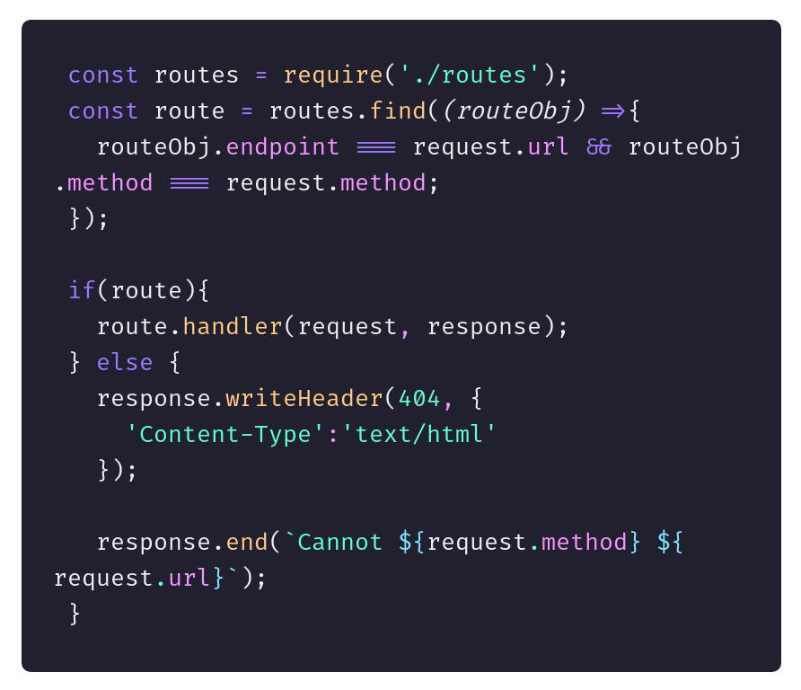
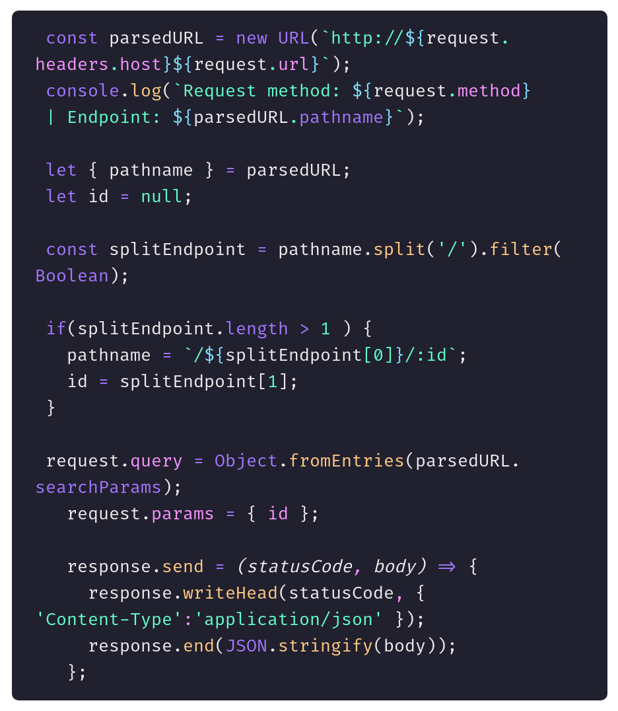

## Mocks
São arquivos utilizados quando precisamos "fingir/forjar" uma base de dados.
  
`English: Mocks are files used when we need to "fake/forge" a database.`
  

## Controllers
Responsavel por armazenar toda a regra de negócio da `API`.
  

`English: Controllers are responsible for storing the entire API business rules.`
  

## Routes
Podem ser divididas em objects para serem iteradas e assim validar se aquela rota existe 
  

`English: Routes can be divided into objects to be iterated over to validate that, that route exists.`

___ex.___:

`routes.js`

`index.js`

## Body, Params, Queries e o Metodo Send
Não são parte intrinseca da request/response e precisam ser tratadas e assim injetadas na request ou na response.
  

`English: Body, params, queries and the method 'Send' are not intrinsically part of the request/response and need to be handled and thus injected into the request or the response.`

